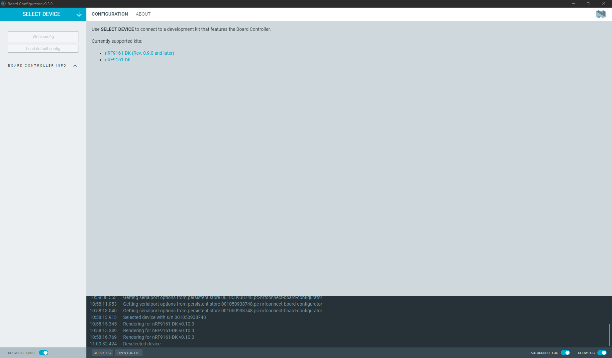
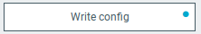
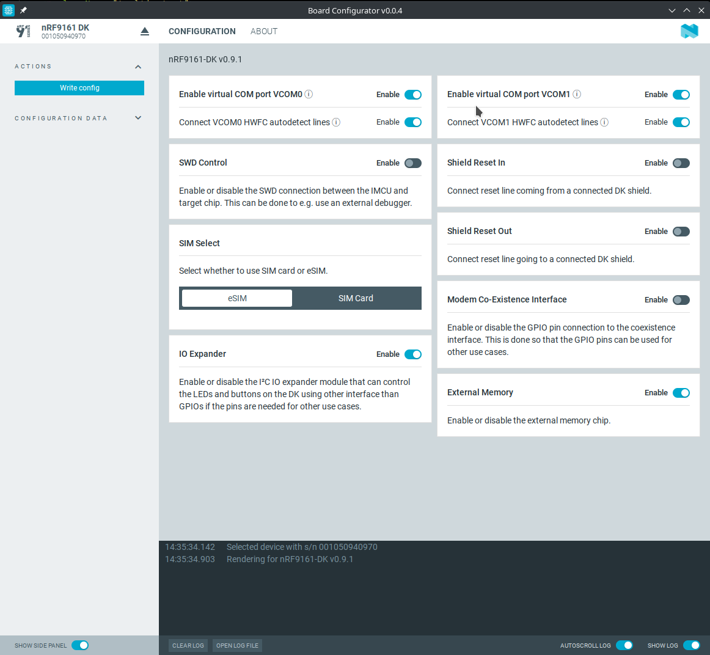

# Overview and user interface

After starting the {{app_name}}, the main application window is displayed.

The available options and information change after you **Select Device**.

## Select Device

Opens the drop-down with the list of devices connected to the computer. You can choose a device from the list of connected devices to perform further actions on the device such as configuring.

## Actions

When you select a device, the following actions become available in the side panel:

- **Write config** - Writes the selected configurations to the development kit, overwriting the defaults.

    !!! note "Note"
         When you have unwritten changes to the board configuration, a blue dot appears next to the **Write config** button.

          

- **Load default config** - Loads the default configuration settings into the application UI for the selected device. It does not write anything to the development kit.

## Board controller info

This side panel area lists advanced information about the board controller configuration:

* **DK Hardware Revision** - Version of the selected device.
* **Board Controller FW version** - Version of the Interface MCU firmware that you are going to [configure](updating.md).
* **Pin Configuration** - List of available GPIO pins, with their respective pin number. Depending on the connected device and its hardware design, different pins are connected to different features.

    !!! note "Note"
        Some of the pins on the list are inverted (active low). This is indicated by the forward slash (`/`). Enabling such pins might disable a setting in the **Configuration** tab, and vice-versa. For example, disabling **Software Debugger** on the nRF9161 DK will enable the `swd-control` pin in the **Pin Configuration**.

* **PMIC Configuration** - List of the BUCK output ports available for configuration. These correspond to the **nPM VUOT** settings in the **Configuration** tab.
* **Show Config JSON** - Click to open the JSON array that lets you review the configuration sent to the board controller. You can copy the configuration to use it in [nRF Util](https://docs.nordicsemi.com/bundle/nrfutil/page/README.html) using the `nrfutil device x-execute-batch` or `nrfutil device x-execute` commands.

## Configuration tab

In the **Configuration** tab, you can see the options that you can [configure](updating.md) for the selected development kit.

## Log

The Log panel allows you to view the most important log events, tagged with a timestamp. Each time you open the app, a new session log file is created. You can find the Log panel and its controls, below the main application Window.

- When troubleshooting, to view more detailed information than shown in the Log panel, use **Open log file** to open the current log file in a text editor.
- To clear the information currently displayed in the Log panel, use **Clear Log**. The contents of the log file are not affected.
- To hide or display the Log panel in the user interface, use **Show Log**.
- To freeze Log panel scrolling, use **Autoscroll Log**.

## Feedback tab

The Feedback tab lets you send feedback about the {{app_name}} to the application development team.

## About tab

You can view application information, restore defaults, access source code, and documentation. You also can find information on the selected device, access support tools, and enable verbose logging.