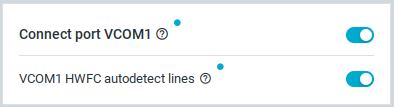

# Updating the board configuration

In the {{app_name}}, you can update the configuration of the board controller on a [supported Nordic Semiconductor Development Kit](index.md#supported-devices).

To update the configuration of a development kit, complete the following steps:

1. Open nRF Connect for Desktop and open the {{app_name}}.
1. Connect a development kit to the computer with a USB cable and turn it on.
1. Click [**Select Device**](./overview.md#select-device) and select the device from the drop-down list. 
   The application reads the Interface MCU configuration on the board.
   The button text changes to the name and serial number of the selected device and the configuration options for the selected device appear, indicating that the device is connected.

    

1. Configure the settings in the [**Configuration**](./overview.md#configuration-tab) tab.

    !!! info "Note"
          - Some options are interdependable. For example, if the VCOM is disconnected, the Hardware Flow Control will automatically be disconnected too.
          - If you are working with nRF54H20, make sure to enable the **External memory** chip option to avoid [issues with DFU or some samples](troubleshooting.md#unable-to-perform-dfu-or-work-with-samples-on-nrf54h20).
          - Advanced users can also configure some of the settings by toggling pins in the [**Pin Configuration**](overview.md#board-controller-info) section.

    The unwritten changes are highlighted with the blue dot next to the modified configuration option, as in the following example.

      

1. Click [**Write config**](./overview.md#actions) to upload the config to the device. 
   The application overwrites the default board controller configuration with the updated settings.
   The **Write config** button is greyed out when the upload is ongoing.
